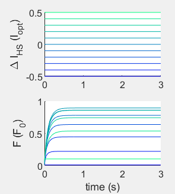
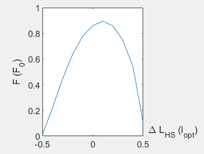
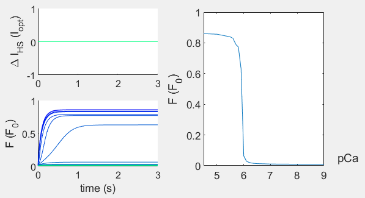

# Part 1 - Muscle models #
In this part of the workshop, you will run a biophysical muscle model that is based on cross-bridge dynamics to simulate force from a muscle fiber.

## **Learning Objectives**  
At the end of this tutorial, you should be able to:  
- Simulate force output from biophysical muscle model under varying length, velocity, and activation conditions  
- Understand the effect of cross-bridge parameters on the steady-state and transient force generation properties of a muscle  
- Compare and contrast force-generating properties of a biophysical and Hill-type muscle model

## Muscle Model
The model consists of:  
1) a contractile element that simulates muscle active force from crossbridge dynamics  
2) elastic elements, in series and in parallel with the contractile element, that simulate muscle passive force

### **Contractile element:**  

1. Concentration of calcium ions (pCa) activate actin sites and make them available for crossbridge binding. Attached corssbirdges can further increase the available actin sites through the process of coopertativity (Campbell et al. 2014).  
2. Crossbridges cycle between detached and attached states governed by attachment rate f(∆x) and detachement rate g(∆x), where ∆x is the length of crossbridge relative to its resting length.  
3. Myosin heads (equvivalent to detached crossbridges) can also enter and leave a 'super-relaxed' state where they cannot attach to actin to form crossbridges. This is govered by entering rate function fSRX (muscle force) and leaving rate function g  SRX  (muscle force), where high muscle force can recruit more myosins from super relaxed state to be available for crossbridge attachment.

## **Assignment 1.0: Run pre-set muscle model**
1. Go to `ISB2025\Part 1\tutorial` and open the script called `GUI_XB_n_Hill.m`
2. Run the code (F5 on Windows, F5 or Fn+F5 on mac). This will open a GUI as shown below

3. Click at different time points on the force time series (bottom right) to see what the crossbridge distribution (bottom left) is at any given time.  

4. Can you intuit how the crossbridge distribution at a given time gives the force (blue line, bottom right) at that time? Note that muscle active force is given by:  
	F = kcb · ∆x  
	Ftotal = ∑ Fi (i=0 to number of bound crossbridges)

## **Assignment 1.1: Simulate effect of cross-bridge rate functions and activation on cross-bridge distribution and force development**
1. Change the attachment and detachment rate parameters and calcium concentration (activation) by clicking at different points on the upper left plot.
2. f and w change the attachment rate fucntion immediately below where you set these parameters.
3. k11, k21 change the left half of the detachment rate function. k21, k22 change the right half of the detachment rate function. Detachment rate function can be found immediately below the attachment rate function.
4. pCa is the calcium concentration which serves as the input activation. pCa = 4.5 = 100%, pCa = 9 = 0%.
  
5. This GUI only allows you to change the values for parameters that change the attachment (f,w) and detachment (k11, k12, k21, k22) rates. Although the model also contains states for cooperativity, these parameters cannot be modified within the GUI. If you would like to simulate the biophysical muscle model outside of the GUI, please see the Alternate Preparation section at the end of the this document.
6. Click RUN to simulate how the crossbridge distributions change and generate force using the new paramters.

7. Click at different time points on the force time series to see what the crossbridge distribution is at any given time and how it affects the force at each given time.
8. Can you intuit how the rate functions affect the crossbridge distribution at steady-state and during stretch?

## **Assignment 1.2: Simulate effect of muscle length change on cross-bridge distributions and force generation**
1. Select the desired attachment and detachment rate parameters and calcium concentration as before.
2. Click on the desired muscle stretch pattern (shorten, lengthen, s cycle, l cycle) to choose different muscle length changes.
3. Click RUN to run the simulation for selected muscle length changes.

4. Click at different time points on the force time series to see what the crossbridge distribution is at any given time and how it affects the force at each given time. 

5. Run 's cycle' and 'l cycle' protocol using differnet rate function parameters. Can you see the effect of crossbridge rate functions on the transient force and its history dependence?

## **Assignment 1.3: Characterize steady-state properties of the muscle fiber: force-velocity**
1. Click `Generate Hill` to run the protocol that simulates stretches to generate a force-length and force-velocity curve based on your crossbridge rate function parameters.
2. This runs a set of simulations where the muscle is held steady at differnt lengths.  
  
3. It plots the force at time 2s against length at 2s to generate a Hill-type force-length curve.  

4. This also runs a set of simulations where muscle is stretched or shotened at a constant velocity.  

5. It plots the force at resting length against the velocity to generate a Hill-type force velocity curve.  

6. Now run differnt protocols to see how the biophysical model and Hill-type model forces compare.
7. Change the rate function parameters and repeat.
8. This protocol also generates a froce-pCa curve which allows you to visualize how pCa relates to the traditionally used Hill-type activation.  

## **Alternative 1.0: Preparation**
If you like, you can simulate these muscle models without GUI and edit the code directly. 
  - *XB_n_Hill.m* allows you to set up attachment/detachment parameters, change activation and simulation protocols. 
  - *FL_FV_FpCa.m* allows you to set up attachment/detachment parameters and simulate stretches to generate a force-length, force-velocity and force-pCa curves. You can save these curves and load into *XB_n_Hill.m* to simulate muscle force based on Hill-type muscle model you generated.  
  
