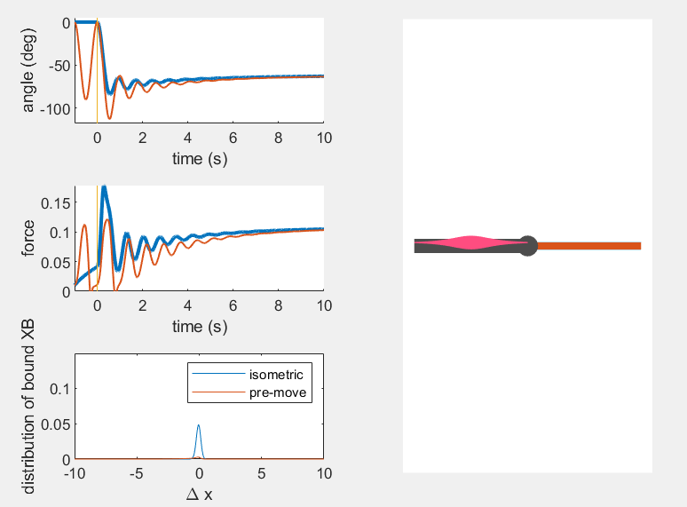
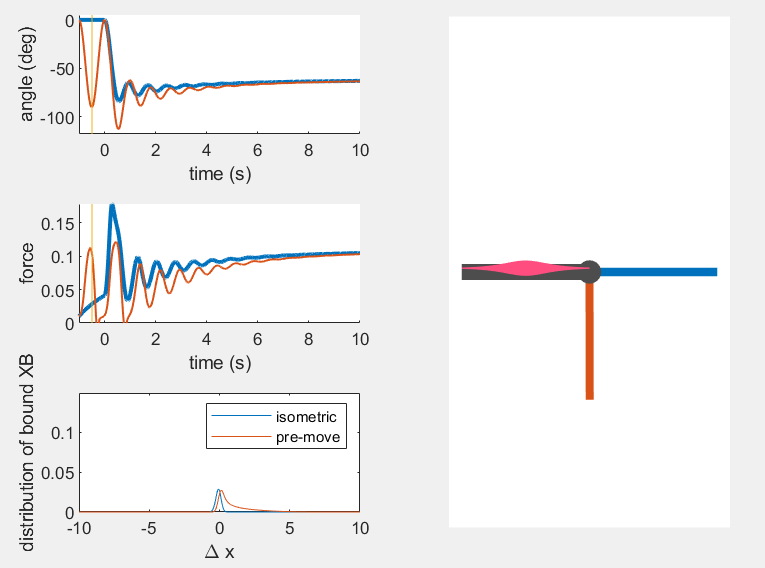
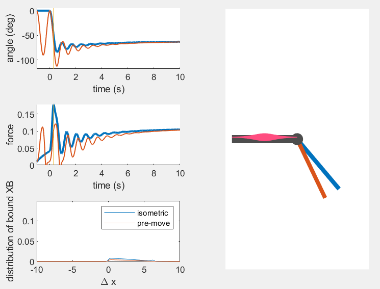

# Part 2 - Dynamics simulation using muscle models #
In this part of the workshop, you will simulate a biophysical muscle model that is based on cross-bridge dynamics to create joint torques about the base of a single link pendulum.

**Learning Objectives**
At the end of this tutorial, you should be able to:
- Simulate a horizontal pendulum actuated by one muscle as a simple conceptual model of the motion of the lower leg about the knee joint when dropped against gravity to demonstrate the role of history-dependent  muscle stiffness on movement.
- (optional) Simulate an inverted pendulum with an agonist-antagonist muscle pair as a simple conceptual model of upright trunk under perturbation to demonstrate the role of muscle short-range stiffness on stability.

**Assignment 2.1: Pendulum test simulation demonstrates history-dependence of the biophysical model**
- Code: Part 2-Custom/kneeTest.m
- Run the code (F5 on Windows or Fn+F5 on Mac).   

You will see two trajectories of the pendulum -- one starting from the isrometric condition (blue) and one starting with a pre-movement (orange).

- Click on the force time series (middle row) to visualize the crossbridge distribution (bottom left) underlying the force at that moment in time. Observe the difference between isometric vs. pre-movement conditions. 

- Bonus: Change baseline activation and run the code again. Try pCa = 6.7, 6.9, 7.2, 8

**(optional) For interested Users: Standing balance simulation with agonist-antagonist muscle pair**
- Code: Part 2-Custom/standingBalance.m
- Run the code (F5 on Windows or Fn+F5 on Mac)
