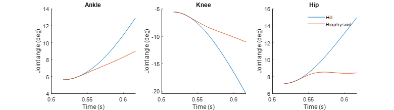
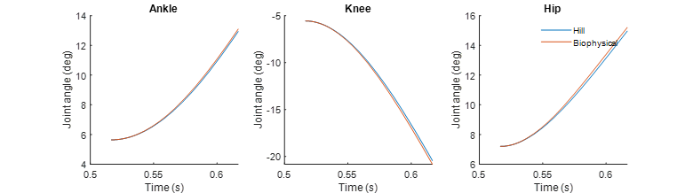
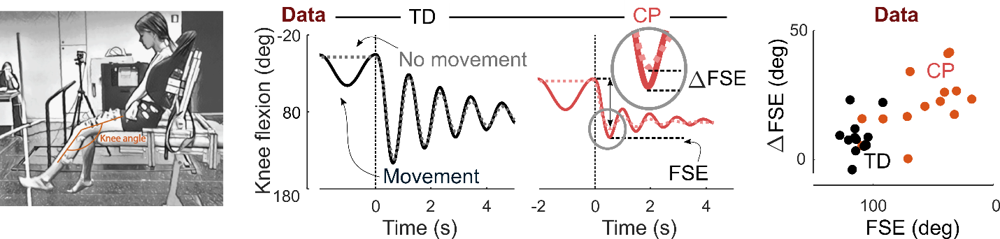
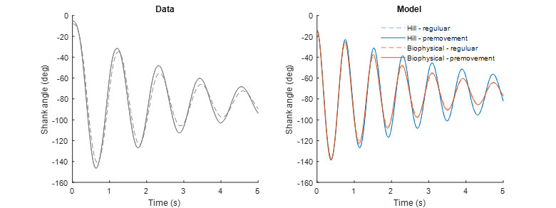
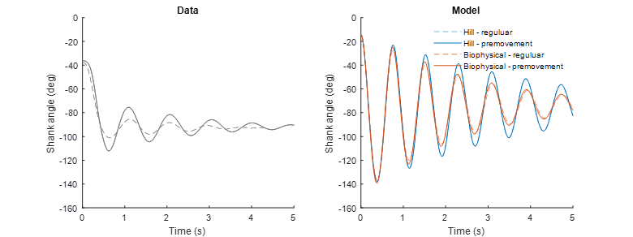
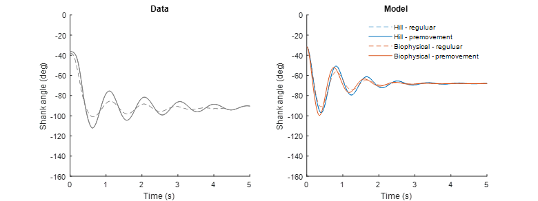
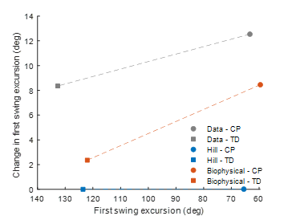

# Part 2 - OpenSim #
In this part of the workshop, you will run movement simulations driven by biophysical (cross-bridge) muscle models. To facilitate this, the biophysical muscle model has been interfaced with skeletal dynamics, formulated and simulated with OpenSim. Two types of movements can be simulated: 
1. perturbed standing balance, and
2. the “pendulum test”, a clinical test of spasticity. 

**Learning Objectives**

At the end of this tutorial, you should be able to:
- Simulate movements driven by biophysical muscle models, using OpenSim software.
- Test the effect of biophysical model parameters on force-velocity and short-range stiffness
- Compare history dependence of movement simulations with biophysical versus Hill-type models
- Use simulations with biophysical muscle models to gain insight into outcomes from a clinical test of joint hyper-resistance in children with cerebral palsy

**Assignment 2.0: Preparation**
  -	Make sure that all dependencies are met (see “Dependencies”)
  -	Go to ISB2025\Part 2 - OpenSim\Movement simulation\code and open the script called ‘main_part2.m’
  -	Run the first Section (Ctrl + Enter on Windows)
  
**Assignment 2.1: Simulate standing balance (default parameters)**

You will run a simulation of the initial response to a perturbation of standing balance. Standing balance is perturbed by a translation of the support surface. We assume that muscle activations are constant during the initial response (50 to 100 ms) due to large neuromuscular delays. In contrast to published simulations (https://doi.org/10.1016/j.jbiomech.2017.02.008), this simulation uses biophysical muscle models. These biophysical models have cross-bridge dynamics alongside cooperative dynamics for actin and myosin activation, described previously (https://doi.org/10.1016/j.bpj.2018.07.006). You will initially use biophysical model parameters that were fitted on data from skinned rat soleus muscle fibers (see Part 1), combined with force-length and elastic element parameters from OpenSim Hill-type models. 

Task: Run the Section titled “Assignment 2.1.1: simulate standing balance”. The following figure will appear:

*Figure 2.1. Standing balance simulation. Blue: simulation with Hill-type models, using OpenSim parameters for human movement. Red: simulation with Biophysical models, using the parameters as in Part 1.*

Question: The resulting movement differs quite a lot between simulations with Hill-type versus biophysical models. Is this surprising? Why (not)?

**Assignment 2.2: Fit model parameters on force-velocity and short-range stiffness**

The main reason for the discrepancy between Hill-type and biophysical models (see Assignment 2.1.1), is that the biophysical parameters were based on data from skinned rat soleus muscle fibers (at room temperature, see Part 1), while Hill-type model parameters are assumed to represent human muscle in vivo. You will therefore re-fit biophysical model parameters such that the biophysical model reproduces the Hill-type force-velocity relation in steady state, while reproducing history-dependent short-range stiffness reductions in dynamic conditions. You can select specific model parameters that are to be fitted (optparms), as well as a weight vector (w) that specifies the weighting of force-velocity and short-range stiffness error terms. The fitting is performed using direct collocation, minimizing the force-velocity and short-range stiffness errors while imposing model dynamics as equality constraints. 

Tasks
-	Run the Section titled “Assignment 2.2.1: fit model parameters” (using default w and optparms). This will run a function that fits the specified parameters. A figure will appear that indicates imposed lengths at the cross-bridge level and the output force trajectories, both as a function of time. 
-	Run the Section titled “Assignment 2.2.2: evaluate model force-velocity and SRS properties”. This results in evaluating the model with newly obtained fitted parameter values. A figure will appear that indicates the model’s force-velocity and short-range stiffness curves. 

Optional tasks: 
-	Run the Section titled “Assignment 2.2.3: compare the rate functions”. This will generate a figure of the rate functions before and after fitting parameters. 
-	Explore how changing the weight vector w affects the ability to fit force-velocity versus short-range stiffness properties. After changing the weight vector, re-run the Section titled “Assignment 2.2.1: fit model parameters”. 

Question: Given the default selection of parameters (i.e. f, k11, k22, k21), is it possible to simultaneously fit force-velocity and short-range stiffness curves?

Task: Add the super-relaxed state cooperativity parameter JF to the list of parameters and re-run the Section titled “Assignment 2.1: fit model parameters”.

Question: Given this new set of parameters (i.e. f, k11, k22, k21, JF), is it possible to simultaneously fit force-velocity and short-range stiffness curves?

**Assignment 2.3: Simulate standing balance (fitted parameters)**

This is the same as Assignment 1, except for using the parameter values obtained during Assignment 2.2. To reproduce the figure below, make sure that the last time the Section titled “Assignment 2.2.1: fit model parameters” was executed, optparms = {'f', 'k11', 'k22', 'k21', ‘JF’} and w = [10 100 1].

Task: Run the Section titled “Assignment 2.3.1: simulate standing balance”. If all went well, the movements for simulations with Hill-type versus biophysical models should now be very similar (see Figure 2.2, below). If not, please ask for instructions. 

*Figure 2.2. Standing balance simulation. Blue: simulation with Hill-type models, using OpenSim parameters for human movement. Red: simulation with biophysical models, using the parameter values obtained during Assignment 2.2.*

**Assignment 2.4: Simulate the pendulum test**

You will simulate a clinical test of spasticity used to characterize joint-hyper resistance in cerebral palsy (CP). During the pendulum test, the patient is asked to relax while the examiner drops the leg from the horizontal position. The knee joint trajectory is recorded. The first swing excursion is decreased in individuals with spasticity. Pre-movement of the lower leg before dropping it has been shown to increase the first swing excursion. This can be captured in simulation when modeling movement history-dependent short-range stiffness. In contrast to published simulations (https://doi.org/10.1109/TNSRE.2024.3381739), this simulation will use biophysical muscle models. The figure below shows experimental data of the pendulum test for a typically developing (TD) child and a child with CP, either without (dashed line) or with pre-movement (solid line). The first swing excursion (FSE) is typically larger if there was pre-movement, particularly in children with CP. 

*Figure 2.3. Experimental pendulum test results.*

Task: Run the Section titled “Assignment 2.4.1: simulate pendulum test - typically developing (TD) child”. A figure will appear with two subplots:
*	Left: data from a typically developing child
    - Solid: with pre-movement 
    - Dashed: without pre-movement
     
* Right: simulation results. All muscle models were given the same constant activation level, specified by the “act” variable. Four different simulations were performed. Like for the data, line style (dashed and solid) indicates whether a pre-movement was performed. In addition, colors indicate the type of muscle model used:
  - Blue: Hill-type model with default OpenSim parameters 
  - Red: Biophysical model with parameters obtained in Assignment 2.2. 

*Figure 2.4: Pendulum test simulation. Left: experimental data for a typical example of a typically developing child, either with pre-movement (solid line) or without pre-movement (dashed line). Right: model simulation using default values of muscle activation and knee angle, either with Hill-type (blue lines) or biophysical model (red lines) and either with pre-movement (solid lines) or without pre-movement (dashed lines).*

Question: For each muscle model (i.e. Hill-type and biophysical), compare simulations with and without pre-movement. Which model has the most history dependence?

Task: Run the Section titled “Assignment 2.4.2: simulate pendulum test - child with cerebral palsy (CP)”. The same figure will appear as before, but this time with data from a child with cerebral palsy. 

*Figure 2.5: Pendulum test simulation. Left: experimental data for a typical example of a child with cerebral palsy, either with pre-movement (solid line) or without pre-movement (dashed line). Right: model simulation using default values of muscle activation and knee angle, either with Hill-type (blue lines) or biophysical model (red lines) and either with pre-movement (solid lines) or without pre-movement (dashed lines).*

Task: The difference between CP and TD may in part be due to differences in initial knee angle and baseline muscle activation. To test this:
-	Change the muscle activation (act) from 2e-2 to 6e-2
-	Change the initial knee angle (phi_knee) from 0 to -0.3 rad.
-	Re-run the Section titled “Assignment 2.4.2: simulate pendulum test - child with cerebral palsy (CP)”. The following figure should appear:

*Figure 2.6: Pendulum test simulation. Left: experimental data for a typical example of a child with cerebral palsy, either with pre-movement (solid line) or without pre-movement (dashed line). Right: model simulation using adjusted values of muscle activation and knee angle, either with Hill-type (blue lines) or biophysical model (red lines) and either with pre-movement (solid lines) or without pre-movement (dashed lines).*

Question: Did the history dependence of the biophysical model increase? If so, was this due to increasing muscle activation or increasing knee angle, or both? If you’re not sure, you could change either muscle activation (act) or the initial knee angle (phi_knee) while keeping the other variable constant, and re-run the Section titled “Assignment 2.4.2: simulate pendulum test - child with cerebral palsy (CP)”.

**Assignment 2.5: Visualize movement in OpenSim**

You can also visualize the output of movement simulations with biophysical models in OpenSim.

*Figure 2.7: OpenSim visualization of pendulum test and standing balance simulations.*

Tasks: Visualize the simulation of the pendulum test. To do this:
-	Open OpenSim (preferably version 4.5)
-	Load the model file. To do that, click on File -> Open Model …  and navigate to ISB2025\Part 2 - OpenSim\Movement simulation\input\pendulum_test. Select leg39_path_actuators.osim file.
-	Load the motion file. To do that, click on on File -> Load Motion … and navigate to ISB2025\Part 2 - OpenSim\Movement simulation\output\pendulum_test. For here, select the subfolder for a given activation that you simulated. In this subfolder, select one of the .sto files. 
-	You can click the “Play” button above the drawing to visualize the motion. This should result in a motion that is similar to that shown in the left panel of Figure 2.7.
-	Repeat this for .sto files from simulations with different models, activation levels, and conditions (i.e. pre-movement versus no pre-movement). 

Task: Visualize the simulation of standing balance. To do this:
-	Load the model file. To do that, click on File -> Open Model …  and navigate to ISB2025\Part 2 - OpenSim\Movement simulation\input\standing_balance. Select SCP_gait4dof9musc.osim file.
-	Load the motion file. To do that, click on on File -> Load Motion … and navigate to ISB2025\Part 2 - OpenSim\Movement simulation\output\standing_balance. Select one of the .sto files. 
-	You can click the “Play” button above the drawing to visualize the motion. This should result in a motion that is similar to that shown in the right panel of Figure 2.7.
-	Repeat this for .sto files from simulations with different models, activation levels, and conditions (i.e. pre-movement versus no pre-movement). 

**Assignment 2.6: Examine the first swing excursion and its change with pre-movement**

Children with CP typically show both a small FSE and a larger increase in FSE with pre-movement (see Figure 2.3, right panel). You will next explore whether this difference between TD and CP can be qualitatively reproduced in simulation.

Task: Run the Section titled: “Assignment 2.6: visualize first swing excursion and its change with pre-movement”. A figure will appear that shows the change in FSE with pre-movement versus the FSE without pre-movement for the data, Hill-type and biophysical models. The figure should look similar to Figure 2.8, shown below. If it does not, please ask for help.

*Figure 2.8: Relation between change in first swing excursion and first swing excursion. Typical example data (grey), Hill-type model (blue) and biophysical model (red) for either a child with cerebral palsy (CP, circles) or a typically developing child (TD, squares). Dashed lines connect the data points to help see trends.*

Question: the biophysical model shows a closer agreement with data than the Hill-type model, but there are still differences between model and data. Consider what could be the cause of these differences. 

**Assignment 2.7: Modify musculoskeletal properties**

Now that you ran movement simulations with biophysical muscle models, you can explore effects of changing skeletal properties or initial posture. 

Tasks: 
-	Open your preferred source code editor (e.g. Notepad ++)
-	Open a text file from your editor. Navigate to ISB2025\Part 2 - OpenSim\Movement simulation\input\pendulum_test. Select the leg39_path_actuators.osim file.
-	Change some model parameters, for example:
  - The mass of the shank (line 187 in the osim file) 
  - The femur angle (line 425 in the osim file). Note: if you adjust femur angle, you need to also adjust it in MATLAB (line 90 of main_part2.m) to get the correct knee angle.
-	Redo Assignments 2.4-2.6 to see how changing these skeletal parameters affected the simulation.
  
